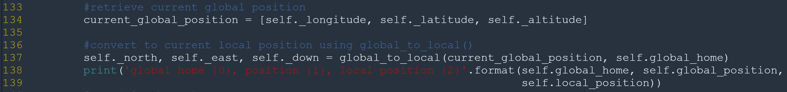

# FCND - 3D Motion Planning


This project is a continuation of the Backyard Flyer project where you executed a simple square shaped flight path. In this project you will integrate the techniques that you have learned throughout the last several lessons to plan a path through an urban environment. Check out the [project rubric](https://review.udacity.com/#!/rubrics/1534/view) for more detail on what constitutes a passing submission.

## Option to do this project in a GPU backed virtual machine in the Udacity classroom!
Rather than downloading the simulator and starter files you can simply complete this project in a virual workspace in the Udacity classroom! Follow [these instructions](https://classroom.udacity.com/nanodegrees/nd787/parts/5aa0a956-4418-4a41-846f-cb7ea63349b3/modules/0c12632a-b59a-41c1-9694-2b3508f47ce7/lessons/5f628104-5857-4a3f-93f0-d8a53fe6a8fd/concepts/ab09b378-f85f-49f4-8845-d59025dd8a8e?contentVersion=1.0.0&contentLocale=en-us) to proceed with the VM. 

## To complete this project on your local machine, follow these instructions:
### Step 1: Download the Simulator
This is a new simulator environment!  

Download the Motion-Planning simulator for this project that's appropriate for your operating system from the [simulator releases respository](https://github.com/udacity/FCND-Simulator-Releases/releases).

### Step 2: Set up your Python Environment
If you haven't already, set up your Python environment and get all the relevant packages installed using Anaconda following instructions in [this repository](https://github.com/udacity/FCND-Term1-Starter-Kit)

### Step 3: Clone this Repository
```sh
git clone https://github.com/udacity/FCND-Motion-Planning
```
### Step 4: Test setup
The first task in this project is to test the [solution code](https://github.com/udacity/FCND-Motion-Planning/blob/master/backyard_flyer_solution.py) for the Backyard Flyer project in this new simulator. Verify that your Backyard Flyer solution code works as expected and your drone can perform the square flight path in the new simulator. To do this, start the simulator and run the [`backyard_flyer_solution.py`](https://github.com/udacity/FCND-Motion-Planning/blob/master/backyard_flyer_solution.py) script.

```sh
source activate fcnd # if you haven't already sourced your Python environment, do so now.
python backyard_flyer_solution.py
```
The quad should take off, fly a square pattern and land, just as in the previous project. If everything functions as expected then you are ready to start work on this project. 

### Step 5: Inspect the relevant files
For this project, you are provided with two scripts, `motion_planning.py` and `planning_utils.py`. Here you'll also find a file called `colliders.csv`, which contains the 2.5D map of the simulator environment. 

### Step 6: Explain what's going on in  `motion_planning.py` and `planning_utils.py`

`motion_planning.py` is basically a modified version of `backyard_flyer.py` that leverages some extra functions in `planning_utils.py`. It should work right out of the box.  Try running `motion_planning.py` to see what it does. To do this, first start up the simulator, then at the command line:
 
```sh
source activate fcnd # if you haven't already sourced your Python environment, do so now.
python motion_planning.py
```

You should see the quad fly a jerky path of waypoints to the northeast for about 10 m then land.  What's going on here? Your first task in this project is to explain what's different about `motion_planning.py` from the `backyard_flyer_solution.py` script, and how the functions provided in `planning_utils.py` work. 

Here is more Explaination about the functionality of what's provided in motion_planning.py and planning_utils.py

## motionplanning.py
In addition to MANUAL, ARMING, DISARMING, TAKEOFF, LANDING, and WAYPOINT, motion_planning also has a PLANNING state. plan_path function contains the logic to impement the planning.

## planning_utils.py
create_grid(data, drone_altitude, safety_distance)
Returns a grid representation of a 2D configuration space based on given obstacle data, drone altitude and safety distance arguments

## Action(Enum)
 An action is represented by a 3 element tuple.
 The first 2 values are the delta of the action relative to the current grid position. The third and final value is the cost of performing the action.

## valid_actions(grid, current_node)
Returns a list of valid actions given a grid and current node.

## a_star(grid, h, start, goal)
implements the eponymous pathfinding algorithm

## heuristic(position, goal_position)
uses Euclidean / Frobenius norm , These scripts contain a basic planning implementation.

### Step 7: Write your planner

Your planning algorithm is going to look something like the following:

- Load the 2.5D map in the `colliders.csv` file describing the environment.
- Discretize the environment into a grid or graph representation.
- Define the start and goal locations. You can determine your home location from `self._latitude` and `self._longitude`. 
- Perform a search using A* or other search algorithm. 
- Use a collinearity test or ray tracing method (like Bresenham) to remove unnecessary waypoints.
- Return waypoints in local ECEF coordinates (format for `self.all_waypoints` is [N, E, altitude, heading], where the drone’s start location corresponds to [0, 0, 0, 0]). 

Some of these steps are already implemented for you and some you need to modify or implement yourself.  See the [rubric](https://review.udacity.com/#!/rubrics/1534/view) for specifics on what you need to modify or implement.

# 7.1 Read lat0 from colliders in to floating point value and set home position

  ## TODO: read lat0, lon0 from colliders into floating point values
  ## TODO: set home position to (lon0, lat0, 0)
  
  #### []
  
# 7.2 Retrieve current global position and convert it to current local position
  ## TODO: retrieve current global position
  ## TODO: convert to current local position using global_to_local()
  
  #### []

# 7.3 Setting grid start position and add flexibility to start location
  ## TODO: convert start position to current position rather than map center
  
  #### []
  
# 7.5: Set goal as some arbitrary position on the grid
 
  ### TODO 6: adapt to set goal as latitude / longitude position and convert

   This step add flexibility to the desired goal location.Should be able to choose any (lat,lon) with in the map
  
  #### []
  
# 7.6: Add Diagnol motions 
   
   ### Run A* to find a path from start to goal
   ### TODO: add diagonal motions with a cost of sqrt(2) to your A* implementation
   ### add diagonal motions with a cost of sqrt(2) to your A* implementation
   ### or move to a different search space such as a graph (not done here)
       
   #### []
   
   ## 7.6.1 . Modify A* to include diagonal motion (or replace A* altogether)
   #### planing_utils.py
   
   ##### 7.6.1.1
   Add Diagonal Motion Cost into Action class
   
   #### []
   
   ##### 7.6.1.2
   Also Check Obstacle for Diagonal Motion
   
   #### []
   
   ##### 7.6.1.3  : Cull waypoints - To eliminate unnecessary waypoints in path
   
   By the help of the Collinearty Check Method [Lecter_6], unnecessary waypoints in path is to eliminate. 
   Breifly, three points p_1, p_2p,p_3 to be collinear, the determinant of the matrix that includes the coordinates 
   of these three points as rows must be equal to zero in three dimension ( necessary but not sufficient) Detail. 
   However in two dimension,z coordinate simply set to 1 and the determinant being equal to zero indicates that the area of the triangle is zero.
   It is a sufficient condition for collinearity.
   
   In motion_planning_sol.py, prune_path() function is used to eliminate unnecessary waypoints
   
   #### []
   
   
   In planing_utils.py , the details of the prune_path() function is given below
   
   a - Obtain points p1 , p2 , p3
   b - Set z coordinate 1 by the help of the point(p) function
   c - Check collinearty of p1, p2, p3 by the help of the collinearity_check(p1, p2, p3) function
       If those points are collinear , remove from pruned_path
       If those point are not collinear , shift one point
   d - Return pruned_path
   
   #### []
       
# 7.8: Convert path to waypoints and Send it to simulator
   
   ## TODO (if you're feeling ambitious): Try a different approach altogether!
    
   []          
              

## Project output video:

[](https://www.youtube.com/watch?v=PO2UXieuD10 "FCND Motion Planning project output video - Click to Watch!")


### Step 9: Write it up!
When you're finished, complete a detailed writeup of your solution and discuss how you addressed each step. You can use the [`writeup_template.md`](./writeup_template.md) provided here or choose a different format, just be sure to describe clearly the steps you took and code you used to address each point in the [rubric](https://review.udacity.com/#!/rubrics/1534/view). And have fun!


## Extra Challenges
### I could not considered extra challange in current project submission, planning to do it in future.
The submission requirements for this project are laid out in the rubric, but if you feel inspired to take your project above and beyond, or maybe even keep working on it after you submit, then here are some suggestions for interesting things to try.

### Try flying more complex trajectories
In this project, things are set up nicely to fly right-angled trajectories, where you ascend to a particular altitude, fly a path at that fixed altitude, then land vertically. However, you have the capability to send 3D waypoints and in principle you could fly any trajectory you like. Rather than simply setting a target altitude, try sending altitude with each waypoint and set your goal location on top of a building!

### Adjust your deadbands
Adjust the size of the deadbands around your waypoints, and even try making deadbands a function of velocity. To do this, you can simply modify the logic in the `local_position_callback()` function.

### Add heading commands to your waypoints
This is a recent update! Make sure you have the [latest version of the simulator](https://github.com/udacity/FCND-Simulator-Releases/releases). In the default setup, you're sending waypoints made up of NED position and heading with heading set to 0 in the default setup. Try passing a unique heading with each waypoint. If, for example, you want to send a heading to point to the next waypoint, it might look like this:

```python
# Define two waypoints with heading = 0 for both
wp1 = [n1, e1, a1, 0]
wp2 = [n2, e2, a2, 0]
# Set heading of wp2 based on relative position to wp1
wp2[3] = np.arctan2((wp2[1]-wp1[1]), (wp2[0]-wp1[0]))
```

This may not be completely intuitive, but this will yield a yaw angle that is positive counterclockwise about a z-axis (down) axis that points downward.

Put all of these together and make up your own crazy paths to fly! Can you fly a double helix?? 


# 3D Motion Planning in Downtown San Francisco
If that all works, well done! All that's left is to build your 3D Motion Planning solution. Check out the README in the project repository for instructions on how to complete the project, and the project rubric for details on what you need for a passing submission.

We have provided some starter code in motion_planning.py and planning_utils.py for you to get comfortable with how things will work for this project. First off, you can just run this code and see what happens. Hit shift-r (sometimes twice) to reset the simulator. Then run:

python motion_planning.py

You should see the quad takeoff and follow a zigzag series of waypoints for about 10 m then land.


Ok flying a double helix might seem like a silly idea, but imagine you are an autonomous first responder vehicle. You need to first fly to a particular building or location, then fly a reconnaissance pattern to survey the scene! Give it a try!
